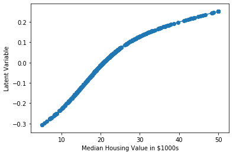
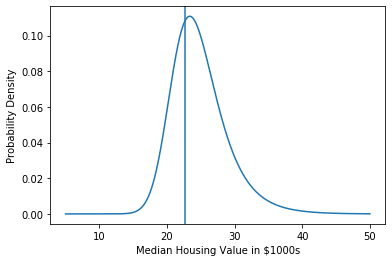

# peak-engines
**peak-engines** is a Python package for building Warped Linear Regression models. 

Warped Linear Regression is like Ordinary Least Squares but with an extra transformation step where
target values are first mapped to latent values using a parameterized monotonic function and adjusted
so as to maximize likelihood on a linear model. The transformation makes Warped Linear Regression more general purpose than
Ordinary Least Squares and able to fit models with non-normal error distributions.

For more details on the math behind Warped Linear Regression models see 
[What to Do When Your Model Has a Non-Normal Error Distribution](https://medium.com/p/what-to-do-when-your-model-has-a-non-normal-error-distribution-f7c3862e475f?source=email-f55ad0a8217--writer.postDistributed&sk=f3d494b5f5a8b593f404e7af19a2fb37).
## Installation

```
pip install peak-engines
```

## Getting started

Load an example dataset
```python
from sklearn.datasets import load_boston
X, y = load_boston(return_X_y=True)
```
Split out training and testing portions
```python
from sklearn.model_selection import train_test_split
X_train, X_test, y_train, y_test = train_test_split(
  X, y, test_size=0.1, random_state=0)
```
Fit a Warped Linear Regression Model
```python
import peak_engines
model = peak_engines.WarpedLinearRegressionModel()
model.fit(X_train, y_train)
```
Visualize the warping function
```python
import numpy as np
import matplotlib.pyplot as plt
y_range = np.arange(np.min(y), np.max(y), 0.01)
z = model.warper.compute_latent(y_range)
plt.plot(y_range, z)
plt.xlabel('Median Housing Value in $1000s')
plt.ylabel('Latent Variable')
plt.scatter(y, model.warper.compute_latent(y))
```


Make predictions
```python
from sklearn.metrics import mean_squared_error
y_pred = model.predict(X_test)
print(mean_squared_error(y_test, y_pred))
41.56037297819257
```
Compute and plot the error distribution of a prediction
```python
logpdf = model.predict_logpdf([X_test[0]])
def pdf(yi):
    return np.exp(logpdf([yi]))
plt.plot(y_range, [pdf(yi) for yi in y_range])
plt.axvline(y_test[0])
plt.xlabel('Median Housing Value in $1000s')
plt.ylabel('Probability Density')
```


## Examples

[example/boston_housing.ipynb](example/boston_housing.ipynb)
    : Build a model to predict housing values.

## Documentation
See [doc/Reference.pdf](doc/Reference.pdf).
