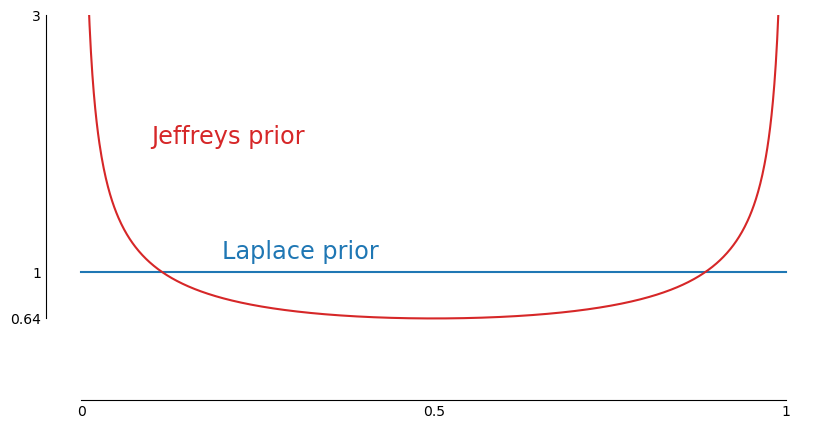

# Introduction to Objective Bayesian Inference
There's a common misconception that Bayesian inference is primarily a subjective approach to statistics and 
frequentist inference provides objectivity. While Bayesian statistics can certainly be used to incorporate 
subjective knowledge, it also provides powerful methods to do objective analysis. Moreover, objective Bayesian
inference probably has a stronger argument for objectivity than many frequentist methods such as P-values
([[13](https://si.biostat.washington.edu/sites/default/files/modules/BergerBerry.pdf)]).

This blog post provides a brief introduction to objective Bayesian inference. It discusses the
history of objective Bayesian inference from inverse probability up to modern reference priors, how 
metrics such as frequentist matching coverage provide a way to quantify what it means for a prior to be objective, 
and how to build objective priors. Finally, it revists a few classical problems studied by Bayes and Laplace to
show how they might be solved with a more modern approach to objective Bayesian inference.

For more complete coverage of the topic, I highly recommend the book [Objective Bayesian Inference](https://www.amazon.com/Objective-Bayesian-Inference-James-Berger/dp/9811284903) by James Berger, Jose Bernardo, and Dongchu Sun.

1. [History](#history)
2. [Priors and Frequentist Matching](#priors-and-frequentist-matching)
    * [Example 1: A Normal Distribution with Unknown Mean](#example-1-a-normal-distribution-with-unknown-mean)
    * [Example 2: A Normal Distribution with Unknown Variance](#example-2-a-normal-distribution-with-unknown-variance)
3. [The Binomial Distribution Prior](#the-binomial-distribution-prior)
4. [Applications from Bayes and Laplace](#applications-from-bayes-and-laplace)
    * [Example 3: Observing only 1s](#example-3-observing-only-1s)
    * [Example 4: A Lottery](#example-4-a-lottery)
    * [Example 5: Birth Rates](#example-5-birth-rates)
5. [Discussion](#discussion)
6. [Conclusion](#conclusion)
# History
In 1654 Pascal and Fermat worked together to solve the [problem of the points](https://en.wikipedia.org/wiki/Problem_of_points)
and in so doing developed an early theory for deductive reasoning with direct probabilities. Thirty years later, Jacob 
Bernoulli worked to extend probability theory to solve inductive problems. 
He recognized that unlike in games of chance, it was futile to 
*a priori* enumerate possible cases and find out "how much more easily can some occur than the others":
> But, who from among the mortals will be able to determine, for example, the
> 	number of diseases, that is, the same number of cases which at each age
> 	invade the innumerable parts of the human body and can bring about our
> 	death; and how much easier one disease (for example, the plague) can
> 	kill a man than another one (for example, rabies; or, the rabies than
> 	fever), so that we would be able to conjecture about the future state
> 	of life or death? And who will count the innumerable cases of changes
> 	to which the air is subjected each day so as to form a conjecture about
> 	its state in a month, to say nothing about a year? Again, who knows the
> 	nature of the human mind or the admirable fabric of our body shrewdly
> 	enough for daring to determine the cases in which one or another
> 	participant can gain victory or be ruined in games completely or partly
> 	depending on acumen or agility of body?
[[1](http://www.sheynin.de/download/bernoulli.pdf), p. 18]

The way forward, he reasoned, was to determine probabilities *a posteriori*
>	Here, however, another way for attaining the desired is really opening
>	for us. And, what we are not given to derive a priori, we at least can
>	obtain a posteriori, that is, can extract it from a repeated
>	observation of the results of similar examples.
[[1](http://www.sheynin.de/download/bernoulli.pdf), p. 18]

To establish the validity of the approach, Bernoulli proved a version of the law of large numbers for the binomial
distribution. Let $X_n$ represent a sample from a Bernoulli distribution with parameter $r/t$ ($r$ and $t$ integers). Then
if $c$ represents some positive integer, Bernoulli showed that for $N$ large enough
```math
	P\left(|\frac{}{N} - \frac{r}{t} | < \frac{2}{t}\right)
	> 
	c \cdot P\left(|\frac{X_1 + \cdots + X_N}{N} - \frac{r}{t} | > \frac{2}{t}\right).
```
In other words, *the probability the sampled ratio from a binomial distribution is contained within the bounds (r−1)/t to (r+1)/t is at least c times more likely than the the probability it is outside the bounds*. Thus, by taking enough samples, “we determine the [parameter] a posteriori almost as though it was known to us a prior”.

Bernoulli, additionally, derived lower bounds, given $r$ and $t$, for how many samples would be needed to achieve 
a desired levels of accuracy. For example, if $r=30$ and $t=50$, he showed
> having made 25550 experiments, it will be more than a thousand times more
> 	likely that the ratio of the number of obtained fertile observations to
> 	their total number is contained within the limits 31/50 and 29/50
> 	rather than beyond them [[1](http://www.sheynin.de/download/bernoulli.pdf), p. 30]

This suggested an approach to inference, but it came up short in several respects. 1) The bounds derived were 
conditional on knowledge of the true parameter. It didn't provide a way to quantify uncertainty 
when the parameter was unknown. And 2) the number of experiments required to reach a high level of confidence in an
estimate, *moral certainty* in Bernoulli's words, was quite large, limiting the approach's practicality.
Abraham de Moivre would later improve on
Bernoulli's work in his highly popular textbook *The Doctrine of Chances*. 
He derive considerably tighter bounds, but again failed to provide a way to quantify uncertainty when
the binomial distribution's parameter was unknown, offering only this qualitative guidance
> if after taking a great number of Experiments, it should be perceived that the
> 	happenings and failings have been nearly in a certain proportion, such
> 	as of 2 to 1, it may safely be concluded that the Probabilities of
> 	happening or failing at any one time assigned will be very near that
> 	proportion, and that the greater the number of Experiments has been, so
> 	much nearer the Truth will the conjectures be that are derived from
> 	them. 
[[2](https://www.ime.usp.br/~walterfm/cursos/mac5796/DoctrineOfChances.pdf), p. 242]
<br>
<br>

INSPIRED BY DE MOIVRE'S book, Thomas Bayes took up the problem of inference with the
binomial distribution. He reframed the goal to
> Given the number of times in which an unknown event has happened and failed: Required the chance
> that the probability of its happening in a single trial lies somewhere between any two degrees of
> probability that can be named. 
[[3](https://web.archive.org/web/20110410085940/http://www.stat.ucla.edu/history/essay.pdf), p. 4]

Recognizing that a solution would depend on prior probability, Bayes sought to
give an answer for
> the case of an event concerning the probability of which we absolutely know nothing antecedently 
> to any trials made concerning it 
[[3](https://web.archive.org/web/20110410085940/http://www.stat.ucla.edu/history/essay.pdf), p. 11]

He reasoned that knowing nothing was equivalent to a uniform prior distribution [4, p. 184-188].
Using the
uniform prior and a geometric analogy with balls, Bayes succeeded in approximating integrals of posterior
distributions of the form
```math
	\frac{\Gamma(n+2)}{\Gamma(y+1) \Gamma(n - y + 1)} \int_a^b \theta^y (1 - \theta)^{n - y} d\theta
```
and was able to answer questions like "if I observe $y$ success and $n - y$ failures from a binomial 
distribution with unknown parameter $\theta$, what is the probability that $\theta$ is between $a$ and $b$?".

Despite Bayes' success answering inferential questions, his method was not widely adopted
and his work, published posthumously in 1763, remained obscure up until De Morgan renewed attention
to it over fifty years later. A major obstacle was Bayes' geometric treatment of integration; as 
mathematical historian Stephen Stigler writes, 
> Bayes essay 'Towards solving a problem in the doctrine of chances' is extremely 
> 	difficult to read today--even when we know what to look for. [4, p. 179]
<br>
<br>

A DECADE AFTER Bayes' death and likely unaware of his discoveries, Laplace pursued similar problems
and independently arrive at the same approach. Laplace revisited the famous problem of the points, but this time considered
the case of a skilled game where the probability of a player winning a round was modeled by a Bernoulli 
distribution with unknown parameter $p$. Like Bayes, Laplace assumed
a uniform prior, noting only
> because the probability that A will win a point is unknown, we may
> 	suppose it to be any unspecified number whatever between $0$ and $1$. [[5](https://www.york.ac.uk/depts/maths/histstat/memoir1774.pdf)]

Unlike Bayes, though, Laplace did not use a geometric approach. He approached the problems with a much more developed 
analytical toolbox and was able to derive more usable formulas with integrals and clearer notation.

Following Laplace and up until the early 20th century, 
using a uniform prior together with Bayes' theorem became a popular approach to statistical inference.
In 1837, De Morgan introduced the term *inverse probability*
to refer to such methods and acknowledged Bayes' earlier work
>  De Moivre, nevertheless, did not discover the inverse method. This was
>  first used by the Rev. T. Bayes, in Phil. Trans. liii. 370.; and the author,
>  though now almost forgotten, deserves the most honourable rememberance from
>	all who read the history of this science. [[6](https://archive.org/details/134257988/page/n7/mode/2up)]
<br>
<br>

IN THE EARLY 20TH CENTURY, inverse probability came under serious attack for its use of a uniform prior. 
Ronald Fisher, one of the fiercest critics, wrote
> I know only one case in mathematics of a doctrine which has
> been accepted and developed by the most eminent men of their
> time, and is now perhaps accepted by men now living, which at the
> same time has appeared to a succession of sound writers to be
> fundamentally false and devoid of foundation. Yet that is quite
> exactly the position in respect of inverse probability 
[[7](https://errorstatistics.com/wp-content/uploads/2016/02/fisher-1930-inverse-probability.pdf)]

Fisher criticized inverse probability as "extremely arbitrary". Reviewing 
Bayes' essay, he pointed out how naive use of a uniform prior leads to solutions that depend on
the scale used to measure probability. He gave a concrete example [[8](http://www.medicine.mcgill.ca/epidemiology/hanley/bios601/Likelihood/Fisher1922.pdf)]: Let $p$ denote the unknown parameter for a
binomial distribution. Suppose that instead of $p$ we parameterize by
```math
  \theta = \arcsin \left(2p-1\right), \quad -\frac{\pi}{2} \le \theta \le \frac{\pi}{2}, 
```
and apply the uniform prior. Then the probability that $\theta$ is between $a$ and $b$ after observing
$S$ successes and $F$ failures is
```math
  \frac{1}{\pi} \int_a^b \left(\frac{\sin \theta + 1}{2}\right)^S \left(\frac{1 - \sin \theta}{2}\right)^F d\theta.
```
A change of variables back to $p$ shows us this is equivalent to
```math
  \frac{1}{\pi} \int_{(\sin a + 1)/2}^{(\sin b + 1)/2} \left(p\right)^{S-1/2} \left(1 - p\right)^{F-1/2} dp.
```
Hence, the uniform prior in $\theta$ is equivalent to the prior $\frac{1}{\pi}p^{-1/2} (1-p)^{-1/2}$ in $p$. As
an alternative to inverse probability, Fisher promoted maximum likelihood methods, p-values, and a frequentist
definition for probability.
<br>
<br>

WHILE FISHER and others advocated for abandoning inverse probability in favor of frequentist methods,
Harold Jeffreys worked to put inverse probability on a firmer foundation. He acknowledged previous
approaches to inverse probability had lacked consistency, but he agreed with their goal of delivering 
statistical results in terms of degree of belief and thought frequentist definitions of probability
to be hopelessly flawed:
>  frequentist definitions themselves lead to no results of the kind that we need until the notion of 
>  reasonable degree of belief is reintroduced, and that since the whole purpose of these definitions
>	is to avoid this notion they necessarily fail in their object. [[9](https://archive.org/details/in.ernet.dli.2015.2608), p. 34]

Jeffreys pointed out that inverse probability needn't be tied to the uniform prior:
>  There is no more need for [the idea that the uniform distribution of the prior probability was a necessary
>  part of the principle of inverse probability] than there is to say that an oven that has once cooked
>	roast beef can never cook anything but roast beef. [[9](https://archive.org/details/in.ernet.dli.2015.2608), p. 103]

Seeking to achieve results that would be consistent under reparameterizations, Jeffreys proposed priors
based on the Fisher information matrix,
```math
  \begin{align*}
  \pi(\boldsymbol{\theta}) &\propto \left[\det{\mathcal{I}(\boldsymbol{\theta})}\right]^{1/2} \\
  \mathcal{I}(\boldsymbol{\theta})_{st} &= \mathbb{E}_{\boldsymbol{y}}\left\{
    \left(\frac{\partial}{\partial \theta_s} \log P(\boldsymbol{y}\mid\boldsymbol{\theta})\right)
    \left(\frac{\partial}{\partial \theta_t} \log P(\boldsymbol{y}\mid\boldsymbol{\theta})\right)
    \mid\boldsymbol{\theta}
  \right\},
  \end{align*}
```
writing
>  If we took the prior probability density for the parameters to be proportional to 
>  [(det I(θ))^(1/2)$]
>  ... any arbitrariness in the choice of the parameters could make no difference to the results,
>  and it is proved that for this wide class of laws a consistent theory of probability can be
>	constructed. [[9](https://archive.org/details/in.ernet.dli.2015.2608), p. 159]

Twenty years later, Welch and Peers investigated priors from a different perspective ([[10](https://academic.oup.com/jrsssb/article-abstract/25/2/318/7035245?redirectedFrom=PDF)]). 
They analyzed one-tailed credible sets from posterior distributions and asked how closely probability
mass coverage matched frequentist coverage. They found that for the case of a single parameter
the prior Jeffreys proposed was asymptotically optimal, providing further justification for the
prior that aligned with how intuition suggests we might quantify Bayes criterion of 
"knowing absolutely nothing".
> Note: Deriving good priors in the multi-parameter case is considerably more involved. Jeffreys himself
> was dissatisfied with the prior his rule produced for multi-parameter models and proposed an
> alternative known as *Jeffreys independent prior* but never developed a rigorous approach.
> José-Miguel Bernardo and James Berger would later develop *reference priors* as a refinement of
> Jeffreys prior. Reference priors provide a general mechanism to produce good priors that works for 
> multi-parameter models and cases
> where the Fisher information matrix doesn't exist. See [[11](https://projecteuclid.org/journals/annals-of-statistics/volume-37/issue-2/The-formal-definition-of-reference-priors/10.1214/07-AOS587.full)] and
> [[12](https://www.amazon.com/Objective-Bayesian-Inference-James-Berger/dp/9811284903), part 3].
<br>
<br>

IN AN UNFORTUNATE turn of events, mainstream statistics mostly ignored Jeffreys approach
to inverse probability to chase a mirage of objectivity that frequentist methods seemed to provide.
> Note: Development of inverse probability in the direction Jeffreys outlined
> continued under the name objective Bayesian analysis; however, it hardly
> occupies the center stage of statistics, and many people mistakenly think of
> Bayesian analysis as more of a subjective theory. 
>
> See [[13](https://si.biostat.washington.edu/sites/default/files/modules/BergerBerry.pdf)] for background on
> why the objectivity that many perceive frequentist methods to have is largely
> false.


But much as Jeffreys had anticipated with his criticism that frequentist
definitions of probability couldn’t provide “results of the kind that we need”,
a majority of practitioners filled in the blank by misinterpreting frequentist
results as providing belief probabilities. Goodman coined the term *P value
fallacy* to refer to this common error and described just how prevalent it is

> In my experience teaching many academic physicians, when physicians are
> presented with a single-sentence summary of a study that produced a surprising
> result with P = 0.05, the overwhelming majority will confidently state that
> there is a 95% or greater chance that the null hypothesis is incorrect. [[14](https://pubmed.ncbi.nlm.nih.gov/10383371/)]

James Berger and Thomas Sellke established theoretical and simulation results
that show how *spectacularly wrong* this notion is

> it is shown that actual evidence against a null (as measured, say, by posterior
> probability or comparative likelihood) can differ by an order of magnitude from
> the P value. For instance, data that yield a P value of .05, when testing a
> normal mean, result in a posterior probability of the null of at least .30 for
> any objective prior distribution. [[15](https://www2.stat.duke.edu/courses/Spring07/sta215/lec/BvP/BergSell1987.pdf)]

They concluded

> for testing “precise” hypotheses, p values should not be used directly, because
> they are too easily misinterpreted. The standard approach in teaching–of
> stressing the formal definition of a p value while warning against its
> misinterpretation–has simply been an abysmal failure. [[16](https://hannig.cloudapps.unc.edu/STOR654/handouts/SellkeBayarriBerger2001.pdf)]

In this post, we’ll look closer at how priors for objective Bayesian analysis
can be justified by matching coverage; and we’ll reexamine the problems Bayes
and Laplace studied to see how they might be approached with a more modern
methodology.

# Priors and Frequentist Matching
The idea of matching priors intuitively aligns with how we might think about
probability in the absence of prior knowledge. We can think of the frequentist
coverage matching metric as a way to provide an answer to the question “How
accurate are the Bayesian credible sets produced with a given prior?”.

> Note: For more background on frequentist coverage matching and its relation to
> objective Bayesian analysis, see [[17](https://www.uv.es/~bernardo/OBayes.pdf)] and [[12](https://www.amazon.com/Objective-Bayesian-Inference-James-Berger/dp/9811284903), ch. 5].
<br>
<br>

CONSIDER A PROBABILITY model with a single parameter $\theta$. If we're given a prior, 
$\pi(\theta)$, how do we test if the prior reasonably expresses 
Bayes' requirement of knowing nothing? Let's pick a size $n$, a value $\theta_\textrm{true}$, and 
randomly sample observations $\boldsymbol{y}=(y_1$, $\ldots$, $y_n)^\top$ from the distribution 
$P(\cdot\vert\theta_\textrm{true})$. Then let's compute the two-tailed credible set $[\theta_a, \theta_b]$ 
that contains 95% of the probability mass of the posterior,
```math
  \pi(\theta\mid\boldsymbol{y}) \propto P(\boldsymbol{y}\mid \theta) \times \pi(\theta),
```
and record whether or not the credible set contains $\theta_\textrm{true}$. Now
suppose we repeat the experiment many times and vary $n$ and $\theta_\textrm{true}$. If $\pi(θ)$ is
a good prior, then the fraction of trials where $\theta_\textrm{true}$ is contained within the
credible set will consistently be close to 95%.

Here’s how we might express this experiment as an algorithm:
```
function coverage-test(n, θ_true, α):
  cnt ← 0
  N ← a large number
  for i ← 1 to N do
    y ← sample from P(·|θ_true)
    t ← integrate_{-∞}^θ_true π(θ | y)dθ
    if (1 - α)/2 < t < 1 - (1 - α)/2:
      cnt ← cnt + 1
    end if
  end for
  return cnt / N
```
## Example 1: a normal distribution with unknown mean
Suppose we observe n normally distributed values, y, with variance 1 and unknown mean, μ. Let’s consider the prior
```math
\pi(\mu) \propto 1
```
> Note: In this case Jeffreys prior and the constant prior in μ are the same.

Then
```math
\begin{align*}
    P(\boldsymbol{y}\mid\mu) 
      &\propto \exp\left\{-\frac{1}{2}\left(\boldsymbol{y} - \mu \boldsymbol{1}\right)'\left(\boldsymbol{y} - \mu \boldsymbol{1}\right)\right\} \\
      &\propto \exp\left\{-\frac{1}{2}\left(n \mu^2 - 2 \mu n \bar{y}\right)\right\} \\
      &\propto \exp\left\{-\frac{n}{2}\left(\mu - \bar{y}\right)^2\right\}.
\end{align*}
```
Thus,
```math
    \int_{-\infty}^t \pi(\mu\mid\boldsymbol{y})d\mu = 
    \frac{1}{2} \left[1 + \textrm{erf}\left(\frac{t - \bar{y}}{\sqrt{2/n}}\right)\right].
```
I ran a 95% coverage test with 10000 trials and various values of μ and n. As
the table below shows, the results are all close to 95%, indicating the
constant prior is a good choice in this case. [Source code for example](https://github.com/rnburn/bbai/blob/master/example/09-coverage-simulations.ipynb).

| $\mu_\textrm{true}$ | n=5 | n=10 | n=20 |
| ---- | -------- | -------- | ------- |
| 0.1  |  0.9502  |  0.9486  |  0.9485 |
| 0.5  |  0.9519  |  0.9478  |  0.9487 |
| 1.0  |  0.9516  |  0.9495  |  0.9519 |
| 2.0  |  0.9514  |  0.9521  |  0.9512 |
| 5.0  |  0.9489  |  0.9455  |  0.9497 |

## Example 2: a normal distribution with unknown variance
Now suppose we observe n normally distributed values, y, with unknown variance
and zero mean, μ. Let’s test the constant prior and Jeffreys prior,
```math
    \pi_C(\sigma^2) \propto 1 \quad\textrm{and}\quad\pi_J(\sigma^2)\propto\frac{1}{\sigma^2}.
```
We have
```math
    P(\boldsymbol{y}\mid\sigma^2) \propto \left(\frac{1}{\sigma^2}\right)^{n/2} \exp\left\{-\frac{n s^2}{2 \sigma^2}\right\}
```
where $s^2 = \frac{\boldsymbol{y}' \boldsymbol{y}}{n}$. Put $u = \frac{n s^2}{2 \sigma^2}$. Then
```math
	\begin{align*}
		\int_0^t 
		\left(\frac{1}{\sigma^2}\right)^{n/2} \exp\left\{-\frac{n s^2}{2 \sigma^2}\right\} d\sigma^2 
			&\propto \int_{\frac{n s^2}{2 t}}^\infty u^{n/2-2} \exp\left\{-u\right\} du \\
			&= \Gamma(\frac{n - 2}{2}, \frac{n s^2}{2 t}).
	\end{align*}
```
Thus, 
```math
    \int_0^t \pi_C(\sigma^2\mid\boldsymbol{y}) d\sigma^2 = 
		  \frac{1}{\Gamma(\frac{n - 2}{2})}
			\Gamma(\frac{n - 2}{2}, \frac{n s^2}{2 t}).
```
Similarly,
```math
    \int_0^t \pi_J(\sigma^2\mid\boldsymbol{y}) d\sigma^2 = 
		  \frac{1}{\Gamma(\frac{n}{2})}
			\Gamma(\frac{n}{2}, \frac{n s^2}{2 t}).
```
The table below shows the results for a 95% coverage test with the constant
prior. We can see that coverage is notably less than 95% for smaller values of
n.
| sigma_true^2  |  n = 5   |  n = 10  |  n = 20 |
| ------------- | -------- | -------- | ------- |
| 0.1           |  0.9014  |  0.9288  |  0.9445 |
| 0.5           |  0.9035  |  0.9309  |  0.9429 |
| 1.0           |  0.9048  |  0.9303  |  0.9417 |
| 2.0           |  0.9079  |  0.9331  |  0.9418 |
| 5.0           |  0.9023  |  0.9295  |  0.9433 |

In comparison, coverage is consistently close to 95% for all values of n if we
use Jeffreys prior. [Source code for example](https://github.com/rnburn/bbai/blob/master/example/09-coverage-simulations.ipynb).
| sigma_true^2  |  n = 5   |  n = 10  |  n = 20 |
| ------------- | -------- | -------- | ------- |
| 0.1           |  0.9516  |  0.9503  |  0.9533 |
| 0.5           |  0.9501  |  0.9490  |  0.9537 |
| 1.0           |  0.9505  |  0.9511  |  0.9519 |
| 2.0           |  0.9480  |  0.9514  |  0.9498 |
| 5.0           |  0.9506  |  0.9497  |  0.9507 |

# The Binomial Distribution Prior
Let’s apply Jeffreys approach to inverse probability to the binomial distribution.

Suppose we observe n values from the binomial distribution. Let y denote the
number of successes and θ denote the probability of success. The likelihood
function is given by
```math
  L(\theta; y) \propto \theta^y (1 - \theta)^{n - y}.
```
Taking the log and differentiating, we have
```math
\begin{align*}
  \frac{\partial}{\partial \theta} \log L(\theta;y) &= \frac{y}{\theta} - \frac{n - y}{1 - \theta} \\
                                       &= \frac{y - n \theta}{\theta(1 - \theta)}.
\end{align*}
```
Thus, the Fisher information matrix for the binomial distribution is
```math
\begin{align*}
  \mathcal{I}(\theta) &= \mathbb{E}_{y} \left\{
    \left(\frac{\partial}{\partial\theta} \log L(\theta;y) \right)^2\mid\theta\right\} \\
  &= \mathbb{E}_{y}\left\{\left(\frac{y - n \theta}{\theta(1 - \theta)}\right)^2\mid\theta\right\} \\
      &= \frac{n \theta (1 - \theta)}{\theta^2 (1 - \theta)^2} \\
      &= \frac{n}{\theta (1 - \theta)},
\end{align*}
```
and Jeffreys prior is
```math
\begin{align*}
  \pi(\theta) &\propto \mathcal{I}(\theta)^{1/2} \\
              &\propto \theta^{-1/2} (1 - \theta)^{-1/2}.
\end{align*}
```



The posterior is then
```math
  \pi(\theta\mid y) \propto \theta^{y-1/2} (1 - \theta)^{n - y - 1/2},
```
which we can recognize as the [beta distribution](https://en.wikipedia.org/wiki/Beta_distribution) with parameters y+1/2 and n-y+1/2.

To test frequentist coverages, we can use an exact algorithm.
```
function binomial-coverage-test(n, θ_true, α):
  cov ← 0
  for y ← 0 to n do
    t ← integrate_0^θ_true π(θ | y)dθ
    if (1 - α)/2 < t < 1 - (1 - α)/2:
      cov ← cov + binomial_coefficient(n, y) * θ_true^y * (1 - θ_true)^(n-y)
    end if
  end for
  return cov
```
Here are the coverage results for α=0.95 and various values of p and n using the Bayes-Laplace uniform prior:
| θ_true  |  n = 5   |  n = 10  |  n = 20  |  n = 100 |
| ----------- | -------- | -------- | -------- | -------- |
| 0.0001      |  0.0000  |  0.0000  |  0.0000  |  0.0000  |
| 0.0010      |  0.0000  |  0.0000  |  0.0000  |  0.9048  |
| 0.0100      |  0.9510  |  0.9044  |  0.8179  |  0.9206  |
| 0.1000      |  0.9185  |  0.9298  |  0.9568  |  0.9364  |
| 0.2500      |  0.9844  |  0.9803  |  0.9348  |  0.9513  |
| 0.5000      |  0.9375  |  0.9785  |  0.9586  |  0.9431  |

and here are the coverage results using Jeffreys prior:

| θ_true  |  n = 5   |  n = 10  |  n = 20  |  n = 100 |
| ----------- | -------- | -------- | -------- | -------- |
| 0.0001      |  0.9995  |  0.9990  |  0.9980  |  0.9900  |
| 0.0010      |  0.9950  |  0.9900  |  0.9802  |  0.9048  |
| 0.0100      |  0.9510  |  0.9044  |  0.9831  |  0.9816  |
| 0.1000      |  0.9914  |  0.9872  |  0.9568  |  0.9557  |
| 0.2500      |  0.9844  |  0.9240  |  0.9348  |  0.9513  |
| 0.5000      |  0.9375  |  0.9785  |  0.9586  |  0.9431  |

We can see coverage is identical for many table entries. For smaller values of
n and p_true, though, the uniform prior gives no coverage while Jeffreys prior
provides decent results. [source code for experiment](https://github.com/rnburn/bbai/blob/master/example/15-binomial-coverage.ipynb)

# Applications from Bayes and Laplace
Let’s now revisit some applications Bayes and Laplace studied. Given that the
goal in all of these problems is to assign a belief probability to an interval
of the parameter space, I think that we can make a strong argument that
Jeffreys prior is a better choice than the uniform prior since it has
asymptotically optimal frequentist coverage performance. This also addresses
Fisher’s criticism of arbitrariness.

> Note: See [12, p. 105–106] for a more through discussion of the uniform prior vs Jeffreys prior for the binomial distribution

In each of these problems, I’ll show both the answer given by Jeffreys prior
and the original uniform prior that Bayes and Laplace used. One theme we’ll see
is that many of the results are not that different. A lot of fuss is often made
over minor differences in how objective priors can be derived. The differences
can be important, but often the data dominates and different reasonable choices
will lead to nearly the same result.

## Example 3: Observing Only 1s
In an appendix Richard Price added to Bayes’ essay, he considers the following problem:
> Let us then first suppose, of such an event as that called M in the essay, or
> an event about the probability of which, antecedently to trials, we know
> nothing, that it has happened once, and that it is enquired what conclusion we
> may draw from hence with respct to the probability of it’s happening on a
> second trial. [[3](https://web.archive.org/web/20110410085940/http://www.stat.ucla.edu/history/essay.pdf), p. 16]

Specifically, Price asks, “what’s the probability that θ is greater than 1/2?”
Using the uniform prior in Bayes’ essay, we derive the posterior distribution
```math
    \pi_\textrm{B}(\theta\mid y) = 2 x.
```

Integrating gives us the answer
```math
    \int_{\frac{1}{2}}^1 2x dx = \left. x^2 \right\rvert_{\frac{1}{2}}^1 = \frac{3}{4}.
```
Using Jeffreys prior, we derive a beta distribution for the posterior
```math
    \pi_J(\theta\mid y) = \frac{\Gamma(2)}{\Gamma(3/2) \Gamma(1/2)} \theta^{1/2} (1 - \theta)^{-1/2},
```

and the answer
```math
    \int_{\frac{1}{2}}^1 \pi_J(\theta\mid y) dx = \frac{1}{2} + \frac{1}{\pi} \approx 0.818
```

Price then continues with the same problem but supposes we see two 1s, three
1s, etc. The table below shows the result we’d get up to ten 1s. [source code](https://github.com/rnburn/bbai/blob/master/example/16-bayes-examples.ipynb)

| 1s observed  |  p > 0.5 (Bayes) |  p > 0.5 (Jeffreys) |
| ------------ | ---------------- | ------------------- |
| 1            |  0.7500          |  0.8183             |
| 2            |  0.8750          |  0.9244             |
| 3            |  0.9375          |  0.9669             |
| 4            |  0.9688          |  0.9850             |
| 5            |  0.9844          |  0.9931             |
| 6            |  0.9922          |  0.9968             |
| 7            |  0.9961          |  0.9985             |
| 8            |  0.9980          |  0.9993             |
| 9            |  0.9990          |  0.9997             |
| 10           |  0.9995          |  0.9998             |

## Example 4: A Lottery
Price also considers a lottery with an unknown chance of winning:

> Let us then imagine a person present at the drawing of a lottery, who knows
> nothing of its scheme or of the proportion of Blanks to Prizes in it. Let it
> further be supposed, that he is obliged to infer this from the number of blanks
> he hears drawn compared with the number of prizes; and that it is enquired what
> conclusions in these circumstances he may reasonably make. [3, p. 19–20]

He asks this specific question:

> Let him first hear ten blanks drawn and one prize, and let it be enquired what
> chance he will have for being right if he gussses that the proportion of blanks
> to prizes in the lottery lies somewhere between the proportions of 9 to 1 and
> 11 to 1. [[3](https://web.archive.org/web/20110410085940/http://www.stat.ucla.edu/history/essay.pdf), p. 20]

With Bayes prior and θ representing the probability of drawing a blank, we derive the posterior distribution
```math
    \pi_B(\theta\mid y) = \frac{\Gamma(13)}{\Gamma(11) \Gamma(2)} \theta^{10} (1 - \theta)^1,
```
and the answer
```math
    \int_{\frac{9}{10}}^{\frac{11}{12}} \pi_B(\theta\mid y) d\theta \approx 0.0770.
```
Using Jeffreys prior, we get the posterior
```math
    \pi_J(\theta\mid y) = \frac{\Gamma(12)}{\Gamma(21/2) \Gamma(3/2)} \theta^{19/2} (1 - \theta)^{1/2}
```
and the answer
```math
    \int_{\frac{9}{10}}^{\frac{11}{12}} \pi_J(\theta\mid y) d\theta \approx 0.0804.
```

Price then considers the same question (what’s the probability that θ lies
between 9/10 and 11/12) for different cases where an observer of the lottery
sees w prizes and 10w blanks. Below I show posterior probabilities using both
Bayes’ uniform prior and Jeffreys prior for various values of w. [source code](https://github.com/rnburn/bbai/blob/master/example/16-bayes-examples.ipynb)
| Blanks  |  Prizes  |  9/10 < p < 11/12 (Bayes)  |  9/10 < p < 11/12 (Jeffreys)  |
| ------- | -------- | -------------------------- | ----------------------------- |
|  10     |  1       |  0.0770                    |  0.0804                       |
| 20      |  2       |  0.1084                    |  0.1107                       |
| 40      |  4       |  0.1527                    |  0.1541                       |
| 100     |  10      |  0.2390                    |  0.2395                       |
| 1000    |  100     |  0.6628                    |  0.6618                       |

## Example 5: Birth Rates
Let’s now turn to a problem that fascinated Laplace and his contemporaries: The
relative birth rate of boys-to-girls. Laplace introduces the problem,

> The consideration of the [influence of past events on the probability of future
> events] leads me to speak of births: as this matter is one of the most
> interesting in which we are able to apply the Calculus of probabilities, I
> manage so to treat with all care owing to its importance, by determining what
> is, in this case, the influence of the observed events on those which must take
> place, and how, by its multiplying, they uncover for us the true ratio of the
> possibilities of the births of a boy and of a girl. [[18](http://www.probabilityandfinance.com/pulskamp/Laplace/memoir_probabilities.pdf), p. 1]

Like Bayes, Laplace approaches the problem using a uniform prior, writing

> When we have nothing given a priori on the possibility of an event, it is
> necessary to assume all the possibilities, from zero to unity, equally
> probable; thus, observation can alone instruct us on the ratio of the births of
> boys and of girls, we must, considering the thing only in itself and setting
> aside the events, to assume the law of possibility of the births of a boy or of
> a girl constant from zero to unity, and to start from this hypothesis into the
> different problems that we can propose on this object. [[18](http://www.probabilityandfinance.com/pulskamp/Laplace/memoir_probabilities.pdf), p. 26]

Using data collection from Paris between 1745 and 1770, where 251527 boys and
241945 girls had been born, Laplace asks, what is “the probability that the
possibility of the birth of a boy is equal or less than 1/2“?

With a uniform prior, B = 251527, G = 241945, and θ representing the probability that a boy is born, we obtain the posterior
```math
		\pi_L(\theta\mid y) = \frac{\Gamma(B + G + 2)}{\Gamma(B + 1) \Gamma(G + 1)}
		   \theta^B (1 - \theta)^G
```
and the answer
```math
		\int_0^{1/2} \pi_L(\theta\mid y) d\theta \approx 1.1460\times 10^{-42}.
```
With Jeffreys prior, we similarly derive the posterior
```math
		\pi_J(\theta\mid y) = \frac{\Gamma(B + G + 1)}{\Gamma(B + 1/2) \Gamma(G + 1/2)}
		   \theta^{B -1/2} (1 - \theta)^{G-1/2}
```
and the answer
```math
		\int_0^{1/2} \pi_J(\theta\mid y) d\theta \approx 1.1458\times 10^{-42}.
```
Here’s some simulated data using p_true = B / (B + G) that shows how the
answers might evolve as more births are observed.
| Boys   |  Girls  |  p < 0.5 (Laplace) |  p < 0.5 (Jeffreys) |
| ------ | ------- | ------------------ | ------------------- |
| 0      |  0      |  0.5000            |  0.5000             |
| 749    |  751    |  0.5206            |  0.5206             |
| 1511   |  1489   |  0.3440            |  0.3440             |
| 2263   |  2237   |  0.3492            |  0.3492             |
| 3081   |  2919   |  0.0182            |  0.0182             |
| 3810   |  3690   |  0.0829            |  0.0829             |
| 4514   |  4486   |  0.3839            |  0.3839             |
| 5341   |  5159   |  0.0379            |  0.0379             |
| 6139   |  5861   |  0.0056            |  0.0056             |
| 6792   |  6708   |  0.2349            |  0.2349             |
| 7608   |  7392   |  0.0389            |  0.0389             |
| 8308   |  8192   |  0.1833            |  0.1832             |
| 9145   |  8855   |  0.0153            |  0.0153             |
| 9957   |  9543   |  0.0015            |  0.0015             |
| 10618  |  10382  |  0.0517            |  0.0517             |

# Discussion
## Q1: Where does objective Bayesian analysis belong in statistics?
I think Jeffreys was right and standard statistical procedures should deliver
“results of the kind we need”. While Bayes and Laplace might not have been
fully justified in their choice of a uniform prior, they were correct in their
objective of quantifying results in terms of degree of belief. The approach
Jeffreys outlined (and was later evolved with reference priors) gives us a
pathway to provide “results of the kind we need” while addressing the
arbitrariness of a uniform prior. Jeffreys approach isn’t the only way to get
to results as degrees of belief, and a more subjective approach can also be
valid if the situation allows, but his approach give us good answers for the
common case “of an event concerning the probability of which we absolutely know
nothing” and can be used as a drop-in replacement for frequentist methods.

To answer more concretely, I think when you open up a standard
introduction-to-statistics textbook and look up a basic procedure such as a
hypothesis test of whether the mean of normally distributed data with unknown
variance is non-zero, you should see a method built on objective priors and
Bayes factor like [[19](https://www.jstor.org/stable/2670175)] rather than a method based on P values.

## Q2: But aren’t there multiple ways of deriving good priors in the absence of prior knowledge?
I highlighted frequentist coverage matching as a benchmark to gauge whether a
prior is a good candidate for objective analysis, but coverage matching isn’t
the only valid metric we could use and it may be possible to derive multiple
priors with good coverage. Different priors with good frequentist properties,
though, will likely be similar, and any results will be determined more by
observations than the prior. If we are in a situation where multiple good
priors lead to significantly differing results, then that’s an indicator we
need to provide subjective input to get a useful answer. Here’s how Berger
addresses this issue:

Inventing a new criterion for finding “the optimal objective prior” has proven
to be a popular research pastime, and the result is that many competing priors
are now available for many situations. This multiplicity can be bewildering to
the casual user. I have found the reference prior approach to be the most
successful approach, sometimes complemented by invariance considerations as
well as study of frequentist properties of resulting procedures. Through such
considerations, a particular prior usually emerges as the clear winner in many
scenarios, and can be put forth as the recommended objective prior for the
situation. [[20](https://www2.stat.duke.edu/~berger/papers/obayes-debate.pdf)]

### Q3. Doesn’t that make inverse probability subjective, whereas frequentist methods provide an objective approach to statistics?

It’s a common misconception that frequentist methods are objective. Berger and
Berry provides this example to demonstrate [[21](https://si.biostat.washington.edu/sites/default/files/modules/BergerBerry.pdf)]: 
Suppose we watch a research
study a coin for bias. We see the researcher flip the coin 17 times. Heads
comes up 13 times and tails comes up 4 times. Suppose θ represents the
probability of heads and the researcher is doing a standard P-value test with
the null hypothesis that the coin is not bias, θ=0.5. What P-value would they
get? We can’t answer the question because the researcher would get remarkably
different results depending on their experimental intentions.

If the researcher intended to flip the coin 17 times, then the probability of
seeing a value *less extreme* than 13 heads under the null hypothesis is given by
summing binomial distribution terms representing the probabilities of getting 5
to 12 heads,
```math
\sum_{k=5}^{12} \binom{17}{k} 0.5^{17} \approx 0.951
```
which gives us a P-value of 1–0.951=0.049.

If, however, the researcher intended to continue flipping until they got at
least 4 heads and 4 tails, then the probability of seeing a value *less extreme*
than 17 total flips under the null hypothesis is given by summing negative
binomial distribution terms representing the probabilities of getting 8 to 16
total flips,
```math
\sum_{k=7}^{15} 2 \binom{k}{3} 0.5^{k+1} \approx 0.979
```
which gives us a P-value of 1–0.979=0.021

The result is dependent on not just the data but also on the hidden intentions
of the researcher. As Berger and Berry argue “objectivity is not generally
possible in statistics and … standard statistical methods can produce
misleading inferences.” [[21](https://si.biostat.washington.edu/sites/default/files/modules/BergerBerry.pdf)] [source code for example](https://github.com/rnburn/bbai/blob/master/example/14-p-value-objectivity.ipynb)

## Q4. If subjectivity is unavoidable, why not just use subjective priors?

When subjective input is possible, we should incorporate it. But we should also
acknowledge that Bayes’ “event concerning the probability of which we
absolutely know nothing” is an important fundamental problem of inference that
needs good solutions. As Edwin Jaynes writes

> To reject the question, [how do we find the prior representing “complete
> ignorance”?], as some have done, on the grounds that the state of complete
> ignorance does not “exist” would be just as absurd as to reject Euclidean
> geometry on the grounds that a physical point does not exist. In the study of
> inductive inference, the notion of complete ignorance intrudes itself into the
> theory just as naturally and inevitably as the concept of zero in arithmetic.
> If one rejects the consideration of complete ignorance on the grounds that the
> notion is vague and ill-defined, the reply is that the notion cannot be evaded
> in any full theory of inference. So if it is still ill-defined, then a major
> and immediate objective must be to find a precise definition which will agree
> with intuitive requirements and be of constructive use in a mathematical
> theory. [[22](https://bayes.wustl.edu/etj/articles/prior.pdf)]

Moreover, systematic approaches such as reference priors can certainly do much
better than pseudo-Bayesian techniques such as choosing a uniform prior over a
truncated parameter space or a vague proper prior such as a Gaussian over a
region of the parameter space that looks interesting. Even when subjective
information is available, using reference priors as building blocks is often
the best way to incorporate it. For instance, if we know that a parameter is
restricted to a certain range but don’t know anything more, we can simply adapt
a reference prior by restricting and renormalizing it [[12](https://www.worldscientific.com/worldscibooks/10.1142/13640#t=aboutBook), p. 256].

> Note: The term pseudo-Bayesian comes from [[20](https://www2.stat.duke.edu/~berger/papers/obayes-debate.pdf)]. See that paper for a more through discussion and comparison with objective Bayesian analysis.

# Conclusion
The common and repeated misinterpretation of statistical results such as P
values or confidence intervals as belief probabilities shows us that there is a
strong natural tendency to want to think about inference in terms of inverse
probability. It’s no wonder that the method dominated for 150 years.

Fisher and others were certainly correct to criticize naive use of a uniform
prior as arbitrary, but this is largely addressed by reference priors and
adopting metrics like frequentist matching coverage that quantify what it means
for a prior to represent ignorance. As Berger puts it,

> We would argue that noninformative prior Bayesian analysis is the single most
> powerful method of statistical analysis, in the sense of being the ad hoc
> method most likely to yield a sensible answer for a given investment of effort.
> And the answers so obtained have the added feature of being, in some sense, the
> most “objective” statistical answers obtainable [[23](https://www.amazon.com/Statistical-Decision-Bayesian-Analysis-Statistics/dp/0387960988), p. 90]


## References
[1] Bernoulli, J. (1713). [On the Law of Large Numbers, Part Four of Ars Conjectandi.](http://www.sheynin.de/download/bernoulli.pdf) Translated by Oscar Sheynin.

[2] De Moivre, A. (1756). [The Doctrine of Chances](https://www.ime.usp.br/~walterfm/cursos/mac5796/DoctrineOfChances.pdf).

[3] Bayes, T. (1763). [An essay towards solving a problem in the doctrine of chances. by the late rev. mr. bayes, f. r. s. communicated by mr. price, in a letter to john canton, a. m. f. r. s](https://web.archive.org/web/20110410085940/http://www.stat.ucla.edu/history/essay.pdf) . Philosophical Transactions of the Royal Society of London 53, 370–418.

[4] Stigler, S. (1990). The History of Statistics: The Measurement of Uncertainty before 1900. Belknap Press.

[5] Laplace, P. (1774). [Memoir on the probability of the causes of events](https://www.york.ac.uk/depts/maths/histstat/memoir1774.pdf)
. Translated by S. M. Stigler.

[6] De Morgan, A. (1838). [An Essay On Probabilities: And On Their Application To Life Contingencies And Insurance Offices](https://archive.org/details/134257988/page/n7/mode/2up).

[7] Fisher, R. (1930). [Inverse probability](https://errorstatistics.com/wp-content/uploads/2016/02/fisher-1930-inverse-probability.pdf). Mathematical Proceedings of the Cambridge Philosophical Society 26(4), 528–535.

[8] Fisher, R. (1922). [On the mathematical foundations of theoretical statistics. Philosophical Transactions of the Royal Society of London](http://www.medicine.mcgill.ca/epidemiology/hanley/bios601/Likelihood/Fisher1922.pdf). Series A, Containing Papers of a Mathematical or Physical Character 222, 309–368.

[9] Jeffreys, H. (1961). [Theory of Probability (3 ed.)](https://archive.org/details/in.ernet.dli.2015.2608). Oxford Classic Texts in the Physical Sciences.

[10]: Welch, B. L. and H. W. Peers (1963). [On formulae for confidence points based on integrals of weighted likelihoods](https://academic.oup.com/jrsssb/article-abstract/25/2/318/7035245?redirectedFrom=PDF). Journal of the Royal Statistical Society Series B-methodological 25, 318–329.

[11]: Berger, J. O., J. M. Bernardo, and D. Sun (2009). [The formal definition of reference priors](https://projecteuclid.org/journals/annals-of-statistics/volume-37/issue-2/The-formal-definition-of-reference-priors/10.1214/07-AOS587.full). The Annals of Statistics 37 (2), 905–938.

[12]: Berger, J., J. Bernardo, and D. Sun (2024). [Objective Bayesian Inference](https://www.amazon.com/Objective-Bayesian-Inference-James-Berger/dp/9811284903). World Scientific.

[13]: Berger, J. O. and D. A. Berry (1988). [Statistical analysis and the illusion of objectivity](https://si.biostat.washington.edu/sites/default/files/modules/BergerBerry.pdf). American Scientist 76(2), 159–165.

[14]: Goodman, S. (1999, June). Toward evidence-based medical statistics. 1: [The p value fallacy](https://pubmed.ncbi.nlm.nih.gov/10383371/). Annals of Internal Medicine 130 (12), 995–1004.

[15]: Berger, J. and T. Sellke (1987). [Testing a point null hypothesis: The irreconcilability of p values and evidence](https://www2.stat.duke.edu/courses/Spring07/sta215/lec/BvP/BergSell1987.pdf). Journal of the American Statistical Association 82(397), 112–22.

[16]: Selke, T., M. J. Bayarri, and J. Berger (2001). [Calibration of p values for testing precise null hypotheses](https://hannig.cloudapps.unc.edu/STOR654/handouts/SellkeBayarriBerger2001.pdf). The American Statistician 855(1), 62–71.

[17]: Berger, J., J. Bernardo, and D. Sun (2022). [Objective bayesian inference and its relationship to frequentism](https://www.uv.es/~bernardo/OBayes.pdf).

[18]: Laplace, P. (1778). [Mémoire sur les probabilités](http://www.probabilityandfinance.com/pulskamp/Laplace/memoir_probabilities.pdf). Translated by Richard J. Pulskamp.

[19]: Berger, J. and J. Mortera (1999). [Default bayes factors for nonnested hypothesis testing](https://www.jstor.org/stable/2670175). Journal of the American Statistical Association 94 (446), 542–554.

[20]: Berger, J. (2006). [The case for objective Bayesian analysis](https://www2.stat.duke.edu/~berger/papers/obayes-debate.pdf). Bayesian Analysis 1(3), 385–402.

[21]: Berger, J. O. and D. A. Berry (1988). [Statistical analysis and the illusion of objectivity](https://si.biostat.washington.edu/sites/default/files/modules/BergerBerry.pdf). American Scientist 76(2), 159–165.

[22]: Jaynes, E. T. (1968). [Prior probabilities](https://bayes.wustl.edu/etj/articles/prior.pdf). Ieee Transactions on Systems and Cybernetics (3), 227–241.

[23]: Berger, J. (1985). [Statistical Decision Theory and Bayesian Analysis](https://www.amazon.com/Statistical-Decision-Bayesian-Analysis-Statistics/dp/0387960988). Springer.
